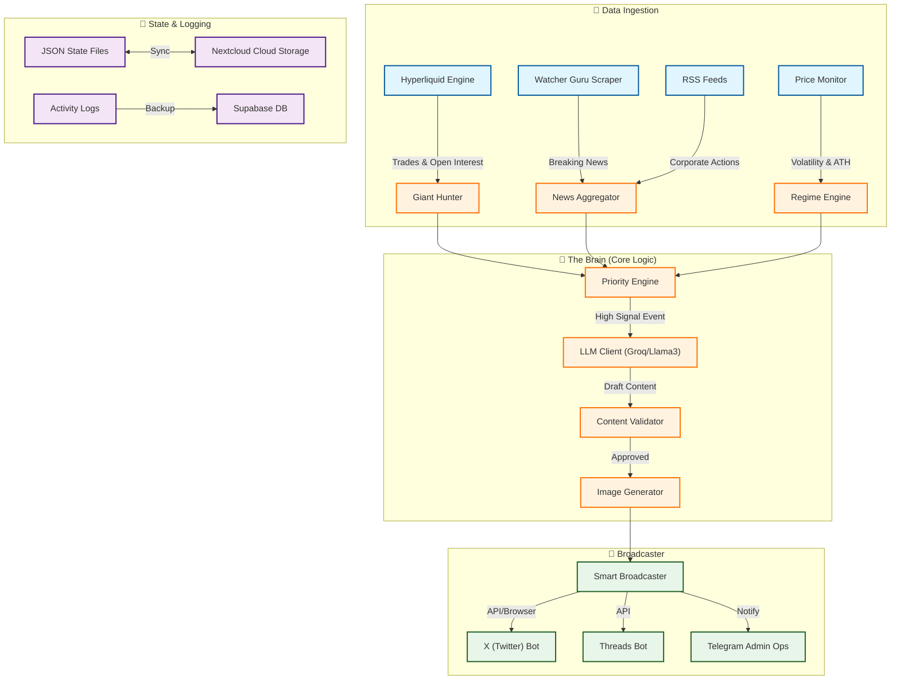

# Dew Protocols: The Autonomous "Just In" Intelligence

  
   

---

## 🌐 What is Dew Protocols?

**Dew Protocols** is not just a bot; it's an **Autonomous Agentic Organization** designed to dominate the crypto news cycle. It operates as a 24/7 "Just In" news aggregator and on-chain analyst, delivering high-speed, high-signal customized content to X (Twitter) and Threads.
---

## 🏗️ System Architecture

Dew Protocols follows a **Data-Driven Event-Loop Architecture**.

