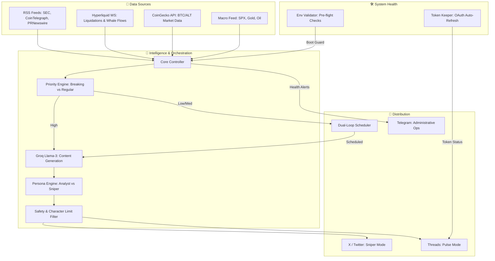

# Dew Protocols: Autonomous Crypto Intelligence Network

  

---

## 🌐 Introduction
**Dew Protocols** (@dewprotocols) is a state-of-the-art autonomous agent designed to navigate the volatile landscape of the cryptocurrency market with precision and speed. Unlike traditional bots that simply repost headlines, Dew Protocols acts as a sophisticated intelligence network, synthesizing real-time data from multiple vectors—price action, on-chain whale movements, and global news feeds—to deliver actionable insights.

Operating 24/7, the system mimics human behavior through a "Dual-Loop" architecture, ensuring it engages with audiences on **X (Twitter)** and **Threads** in a way that feels organic, timely, and authoritative. It doesn't just report the news; it interprets it, adapting its persona to fit the platform and the market sentiment.

## 🚀 Core Capabilities

### 1. The "Dual-Loop" Engine
The heart of Dew Protocols is its ability to manage two distinct social ecosystems simultaneously:
*   **The Pulse (Threads)**: Designed for high-frequency engagement. The bot maintains a steady stream of updates (every 5-15 minutes), capturing the "pulse" of the market during peak hours. It aims to maximize visibility within the daily post limits.
*   **The Sniper (X/Twitter)**: Built for high-impact communication. Recognizing the noise on X, the bot engages "Sniper Mode," firing off 15 curated, high-value posts per day during critical engagement windows (06:00, 12:00, 18:00), ensuring maximum reach and relevance.

### 2. Cognitive AI Content Generation
Dew Protocols leverages advanced Large Language Models (LLMs) to generate content that transcends basic automation:
*   **Adaptive Persona**: It switches seamlessly between a "Street-Smart" analyst for casual Threads updates and a "Breaking News" reporter for urgent Twitter alerts.
*   **Contextual Intelligence**: Before drafting a tweet, the AI analyzes current market sentiment, technical indicators, and recent on-chain events to ensure the commentary is astute and relevant.
*   **Smart Formatting**: The engine strictly adheres to platform-specific constraints (350 chars for Threads, 150 for X) while automatically highlighting key data points like percentage changes.

### 3. Hyper-Vigilant Market Monitor
The system keeps an unblinking eye on the market:
*   **Multi-Asset Tracking**: continuously monitors the heartbeat of major assets including BTC, ETH, SOL, XRP, BNB, and Gold (PAXG).
*   **Whale Watcher**: Integrated directly with Hyperliquid, it detects significant capital flows and "Whale" movements, alerting followers to potential market-moving events before they hit the mainstream news.
*   **Trend & Volatility Detection**: Algorithms identify "Pump" or "Dump" scenarios in real-time, triggering immediate compliance overrides to prioritize breaking news over scheduled content.

### 4. Enterprise-Grade Infrastructure
Built for resilience and reliability:
*   **Self-Healing Authentication**: The "Token Keeper" module runs in the background, auto-refreshing OAuth tokens every 30 minutes to guarantee zero downtime.
*   **Pre-Flight Validation**: A robust set of environmental checks ensures all API keys and external services are operational before the system initiates.
*   **Ops Central (Telegram)**: A dedicated command channel allows administrators to receive health reports, validation status, and error logs instantly.

---

## 🏗️ System Architecture

---

## 🛠️ Technology Stack

*   **Core**: Python 3.12
*   **Intelligence**: Gemini 2.5 Flash
*   **Data Aggregation**: CoinGecko, Hyperliquid, RSS Feeds
*   **Orchestration**: Custom Threaded Scheduler, Cron
*   **Ops & Monitoring**: Telegram Bot API

---

> 🔒 *Note: This repository contains a portfolio showcase for Dew Protocols. The source code is private intellectual property.*
