# Dew Protocols: The Autonomous "Just In" Intelligence

  
   

---

## 🌐 What is Dew Protocols?

**Dew Protocols** (@dewprotocols) is not just a bot: it's an **Autonomous Agentic Organization** designed to dominate the crypto news cycle. It operates as a 24/7 news aggregator and on-chain analyst, delivering high-speed, high-signal customized content to X (Twitter) and Threads.

---

## 🏗️ System Architecture

Dew Protocols follows a **Data-Driven Event-Loop Architecture**.

```mermaid
graph TD
    subgraph Data_Layer ["📡 Data Ingestion"]
        HL[L2 On-Chain Engine] -->|Trades & Open Interest| GH[Giant Hunter]
        W[Global News Scraper] -->|Breaking News| NA[News Aggregator]
        RSS[Corporate Feeds] -->|Corporate Actions| NA
        Price[Price Monitor] -->|Volatility & ATH| RE[Regime Engine]
    end

    subgraph Logic_Layer ["🧠 The Brain (Core Logic)"]
        GH & NA --> PE[Priority Engine]
        RE --> PE
        PE -->|High Signal Event| LLM["Cognitive Core (AI Model)"]
        LLM -->|Draft Content| VAL[Content Validator]
        VAL -->|Approved| IG[Image Generator]
    end

    subgraph Storage_Layer ["💾 State & Logging"]
        States[State Files] <-->|Sync| NC[Encrypted Cloud Storage]
        Logs[Activity Logs] -->|Backup| SB[Time-Series DB]
    end

    subgraph Action_Layer ["🚀 Broadcaster"]
        IG --> Poster[Smart Broadcaster]
        Poster -->|API/Browser| Twitter["X (Twitter) Bot"]
        Poster -->|API| Threads[Threads Bot]
        Poster -->|Notify| TG[Admin Ops]
    end

    %% formatting
    classDef source fill:#e1f5fe,stroke:#01579b,stroke-width:2px,color:#000;
    classDef logic fill:#fff3e0,stroke:#ff6f00,stroke-width:2px,color:#000;
    classDef storage fill:#f3e5f5,stroke:#4a148c,stroke-width:2px,color:#000;
    classDef action fill:#e8f5e9,stroke:#1b5e20,stroke-width:2px,color:#000;

    class HL,W,RSS,Price source;
    class GH,NA,RE,PE,LLM,VAL,IG logic;
    class States,Logs,NC,SB storage;
    class Poster,Twitter,Threads,TG action;
```

